# 🐣 S1 | Prog: Workshop

Template de projet pour le workshop de prog des Imac1. Vous trouverez le sujet ici: https://dsmte.github.io/Learn--cpp_programming/Workshop

## Keep Green Only

## Echanger les canaux

## Noir & Blanc
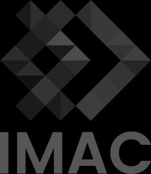

## Negatif

## Degradé

## Miroir

## Image Bruitée
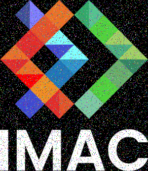

## Rotation 90

## RGB
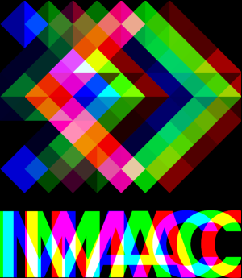

## Disque

## Cercle
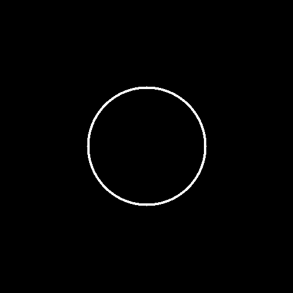

## Animation

## Rosace
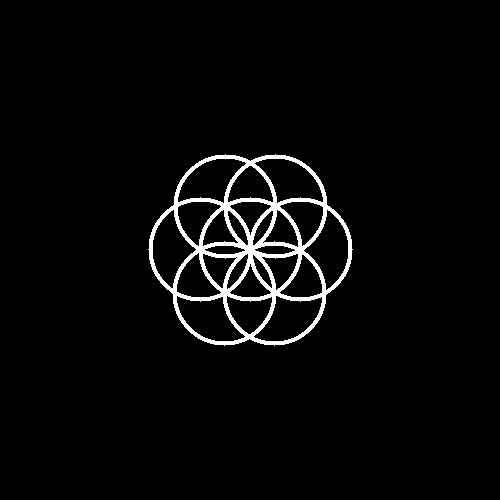

## Mosaique

## Mosaique mirror

## Glitch
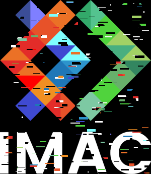

## Tri Pixels

## Gradient Oklab
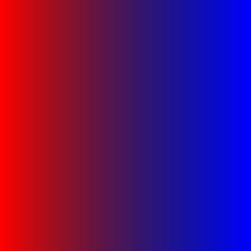

## Fractale
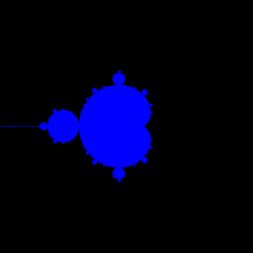

J'ai choisi de modifier un peu l'aspect visuel de ma fractale en ajoitant des couleurs sur les composants RGB pour obteniur une fractale bleutée.

## Tramage
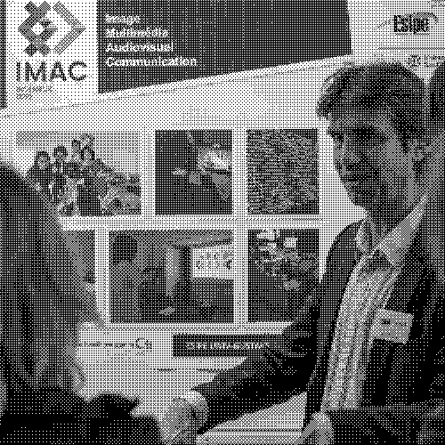

## Normalisation de l'histogramme

## Noir & Blanc

## Vortex
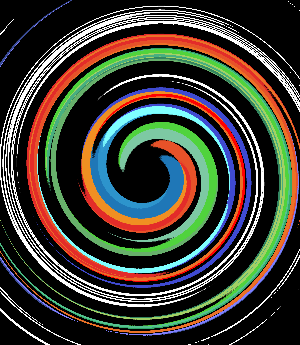

## Vortex Eye
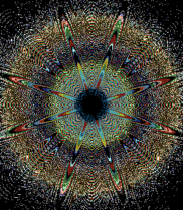

Ce résultat est apparu quand j'essayais de trouver une valeur pour l'angle dans le vortex. Dans la version classique je divise par 10 mais ici je le multiplie `float angle = dist * 10;`

## Convolution

## Convolution 2

Pour ce convolution j'ai implementer une matrice de 3 par 3 avec les valeurs données sur image-kernels pour obtenir une convolution sharpen.

## Convolution 3

Pour ce convolution j'ai implementer une matrice de 3 par 3 avec les valeurs données sur image-kernels pour obtenir une convolution outline.